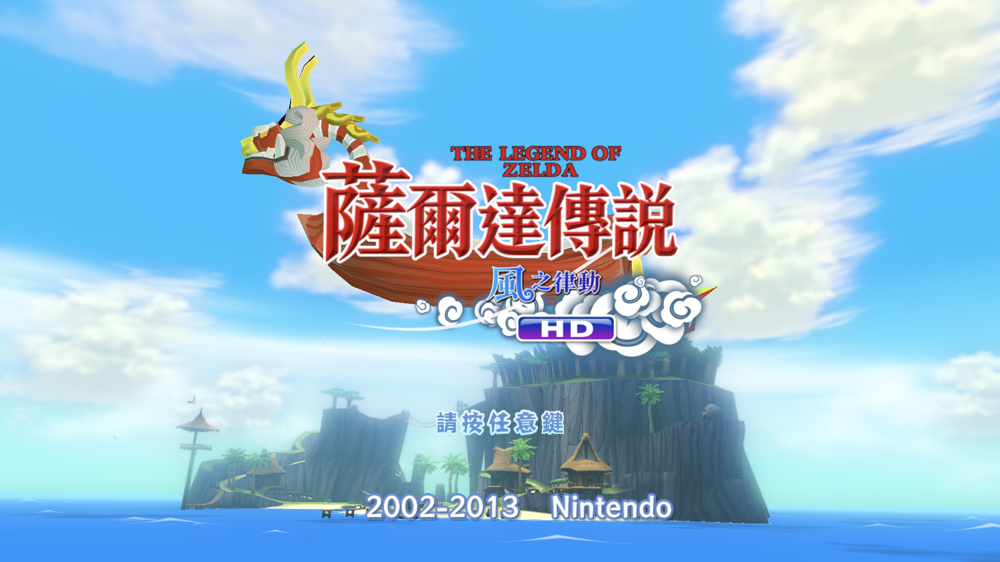
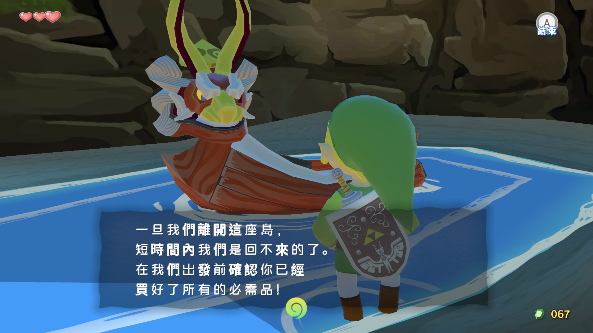
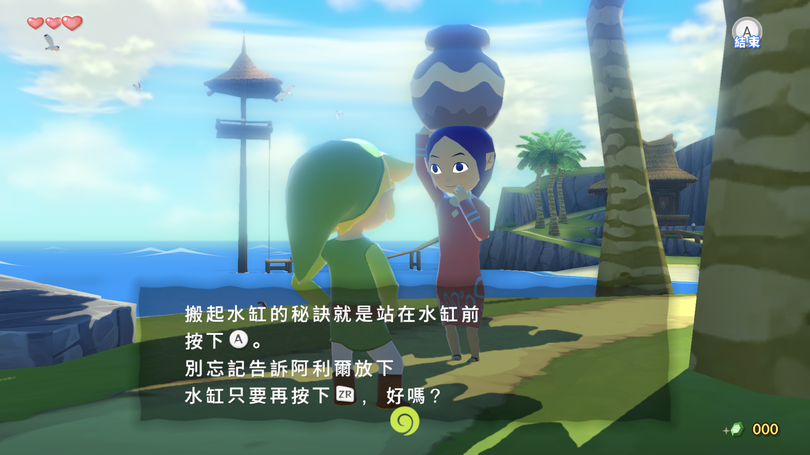
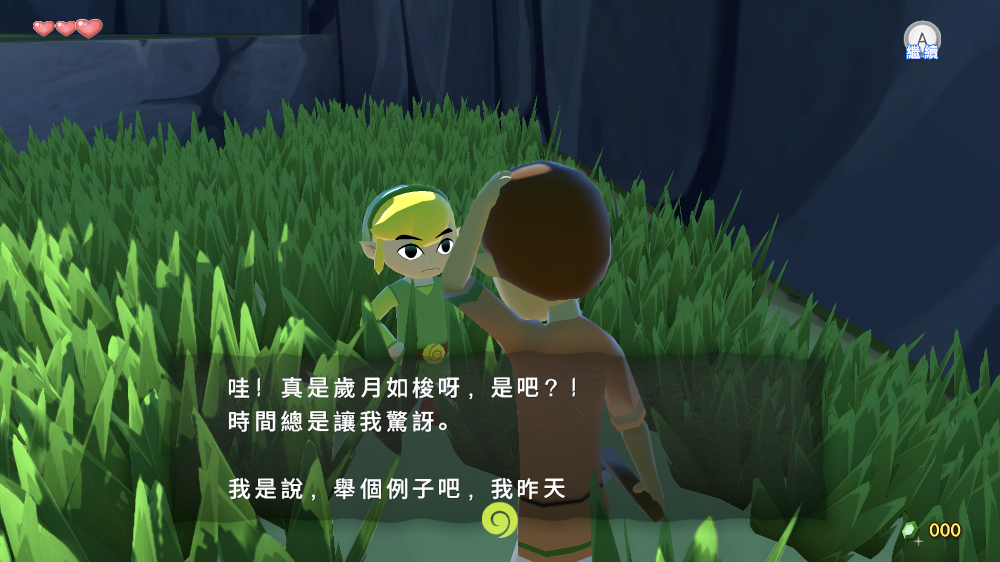
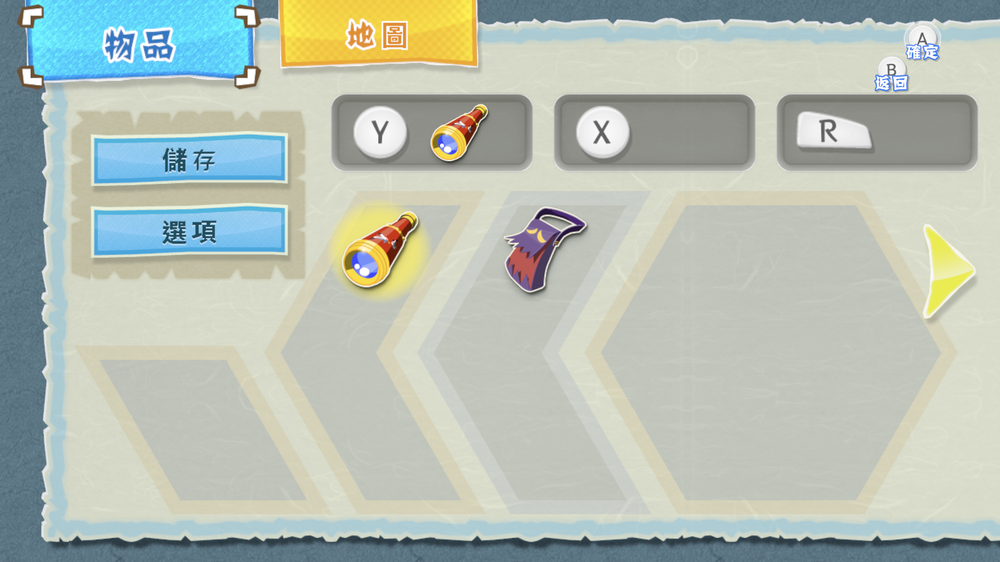

# 薩爾達傳說 風之律動 HD — 繁體中文化 (zh-TW)

> Fork 自 [wmltogether/ZLD-TWW-HD-Chinese-Localization-Project](https://github.com/wmltogether/ZLD-TWW-HD-Chinese-Localization-Project)
> 原專案是 WiiU《The Legend of Zelda: The Wind Waker HD》的非官方**簡體**中文語言包。
> 本分支把它轉成**繁體中文（台灣用語）**，保留原版英文主標，重繪繁中小字與副標。
> 原始說明保留於 [README.upstream.md](README.upstream.md)。

原專案的工具是 Python 2 寫的，本分支保留原檔（`fontBuilder.py`、`repack_text.py`、
`unpack_text.py`、`Cafe/`、`NGC/`、`Patch/`）作為出處，另外在 `tools/` 提供一套
可重現的 Python 3 建置流程。

---

## 畫面



保留原版「THE LEGEND OF ZELDA」與 HD，左下小字為「薩爾達傳說」，副標為「風之律動」。
上圖為 Cemu Android 的美版遊戲實測畫面，主機語言設為 English。

以下四張為 Cemu Android 上的對話字型實測畫面：`CKingMsg` 漢字統一為 500 字重，
選單維持原有字體樣式，按需補字。500 字重對話字型自正式版 `tw-v1.0.8` 起納入。









---

## 成果

| 項目 | 內容 |
|---|---|
| 文字 | 5,040 則全數核對；tw-v1.0.10 相較上一版修正 700 則 |
| 字型 | `CKingMsg` 4,390 → 5,398 字，漢字採 500 字重；`CKingMain`/`MainL` 569 → 761 字 |
| 標題畫面 | 原版英文主標與 HD，搭配繁中小字「薩爾達傳說」及副標「風之律動」；掃光遮罩依新字形重建 |
| 譯名 | 以任天堂官方繁中譯名為準，無官方譯名者沿用民間慣用（見下方） |
| 校潤 | 與美版英文文本逐句對照，依原意修正譯名、錯字與不順的句子 |
| 缺字 | 0 |

---

## 做法

### 1. 容器層

語言包 `permanent_2d_UsEnglish.pack` 是 SARC（外層對齊 0x2000），內含
`*_msbt.szs` / `*_bffnt.szs` 等 Yaz0 + SARC 巢狀封存，共 2,085 個葉節點檔案。

`tools/sarc.py` 讀寫 SARC 與 Yaz0。重打包後的位元組與原檔完全相同
（`tools/check_repack.py` 驗證）。

### 2. 文字層

MSBT 的 `TXT2` 區塊是 UTF-16BE，中間夾雜控制碼（`0x000E` 帶長度欄位、`0xE0xx` 兩位元組）。

`tools/msbt.py` 把訊息拆成 typed segment：

```python
("t", "純文字")          # 只有這種會送進 OpenCC
("c", b"\x00\x0e...")   # 控制碼原封不動複製
```

**控制碼絕對不會被轉換工具碰到**，這是不讓遊戲當掉的關鍵。

轉換用 OpenCC `s2twp`，再套用 `tools/convert_text.py` 的 `TERMS` 詞表補正。

> MSBT 內含手動換行符。修改後須檢查行寬及實際版面；靜態長度檢查不等於實機顯示驗收。

### 3. 英文原文對照

美版原作的 `permanent_2d_UsEnglish.pack` 與中文語言包是**完全同構**的：
68 個 MSBT、5,040 則訊息，連 LBL1 標籤都一模一樣，所以可以直接一對一對齊。

```powershell
.\.venv\Scripts\python.exe tools\expand_tree.py <英文版 pack> work\tree_en out\inventory_en.txt
.\.venv\Scripts\python.exe tools\align_en.py work\tree_en work\tree_zhtw
```

產出 `out/bilingual.tsv`（逐句英中對照）、`out/review_flagged.txt`（可疑句）、
`out/glossary.txt`（專有名詞的中文譯法一致性）。

官方譯名則是抓 Zelda Wiki 的結構化譯名資料（`Data:Translations/<遊戲>`，
含 `zhT` 繁中欄位）來比對。風之律動本身沒有官方中文，但它與曠野之息、
王國之淚、智慧的再現、織夢島、天空之劍 HD、大亂鬥特別版共用的術語有：

```powershell
.\.venv\Scripts\python.exe tools\fetch_glossary.py      # → text/glossary_official.json
.\.venv\Scripts\python.exe tools\check_glossary.py work\tree_en work\tree_zhtw
```

需要人工判斷的逐句修正寫在 `text/overrides.json`，由 `tools/apply_overrides.py`
在繁化之後套用。它會檢查控制碼的多重集合有沒有變，避免改壞文字框。

一個例子：「Fairy」官方是「妖精」，但中文同樣用「精靈」翻過 spirit
（德庫樹、加布），因此不能一律取代，而是逐句依英文原文判定。

#### 全文逐行校對（tw-v1.0.3）

自動掃描只抓得到「看起來怪」的字串，抓不到「看起來很正常但意思相反」的誤譯，
所以 tw-v1.0.3 把 5,040 則訊息的英中對照 **從頭到尾讀過一遍**，
累積 442 條逐句修正（`text/overrides.json`）＋約 260 條全域規則
（`tools/convert_text.py` 的 `TERMS`）。抓到的問題大致分成六類：

| 類型 | 例子 |
| --- | --- |
| 語意相反 | 「你沒有注意他麼」→「你千萬別理他」（EN: *Don't you pay any attention to him*） |
| 成語／慣用語誤譯 | 「他也會因為遺失了一頂帽子而流淚」→「動不動就掉眼淚」（EN: *cries at the drop of a hat*） |
| 一字多義選錯 | 「把那隻怪鳥給畫下來」→「引開」（EN: *draw that monster bird off*）、<br>「對準那些吸盤放箭」→「用那些箭對準我射」（EN: *aim those suckers at me*） |
| 遊戲性錯誤 | 30 個炸彈標價 30 盧比（原文 60）、海圖左右說反、<br>Drona 的座標抄成 Oakin 的、選單少一個選項 |
| 譯文被截斷 | 「那些關於聖」、「達芬尼斯」（人名只剩三個字） |
| 用語不當 | 「我覺得那強姦了我的耳朵」→「我剛才好像有點失禮」（EN: *that was kind of rude*） |

校對過程另外加了兩個機器可驗的檢查，兩者現在都是零錯誤：

```powershell
# 選單選項數量必須與英文一致（少一項會讓玩家選不到）
# 中英文出現的數字必須一致（價格、數量、座標）
```

#### 把人工找到的錯誤變成機器檢查（tw-v1.0.4）

上面那一輪逐行校對漏掉了兩類東西，是玩的時候被抓到的：

- **語域**：「您走好」語意上完全對應 *Bye!*，所以「跟英文比對」這個框架永遠抓不到它
  （而「走好」在台灣是對往生者說的）。
- **同類未推廣**：`message2#04114` 的「通關考驗」被改成「通過」，
  但七則之後同一個 NPC 的 `message2#04121`「透過的考驗」卻漏了 ——
  修了個案沒有回頭掃全文。

結論是**人工讀過不等於該類錯誤已清空**，所以把每一種找到的錯誤都寫成偵測器：

```powershell
.\.venv\Scripts\python.exe tools\qa_align.py out\bilingual.tsv out\qa_report.txt
.\.venv\Scripts\python.exe tools\audit_register.py out\bilingual.tsv out\register_audit.txt
```

| 檢查 | 抓什麼 |
| --- | --- |
| `stray-latin` | 中文句中夾雜的孤立英文字母（打字殘留） |
| `punct-residue` | 全形半形標點疊在一起（`？!`、`。.`） |
| `dup-phrase` | 相鄰重複字串（「然後快速按下然後快速按下」） |
| `truncated` | 英文有句尾標點、中文沒有 |
| `too-short` | 中文長度不到英文五分之一（漏譯） |
| `long-line` | 單行超過 34 全形字（文字框爆版） |
| `negation-flip` | 英文有強否定、中文沒有（語意顛倒） |
| `question-flip` | 問句與非問句不對應 |
| `classifier` | 量詞與名詞不搭 |
| `term-mismatch` | 已知英文專名沒有使用一致的繁中譯名 |
| `readability-residue` | 已確認會妨礙理解的生硬措辭再次出現 |
| `duplicate-layout-control` | 相鄰重複版面控制碼改變訊息顯示 |
| `audit_register` | 陸語語域、兒化殘留、s2twp 把「通過」轉成「透過」 |

這一輪又挖出 11 條語意錯誤與 40 條語域問題，其中包含一個**只有機器抓得到**的問題：
`message2#05690` 用了「裡」，但選單字型 `CKingMain` 的字數上限裝不下這個字，
在選單情境會顯示空白 —— `build.ps1` 的 `menu_chars.py` 後檢查會擋下來。

#### 全文重新比對與回歸審核（tw-v1.0.5）

tw-v1.0.5 不沿用前一輪「已經看過」的結論，重新審查最新的 5,040 則英中對照：

1. 切成 24 個不重疊區塊，每區 210 則；另用程式核對起訖 key 與連續覆蓋，缺段 0。
2. 第一層逐則檢查英文語意與台灣繁中；第二層對照原始 TSV 剔除誤報；
  第三層排除純潤色、同義詞與既定譯名差異。
3. 對 810 個修改過的 key 產生 `英文 / 修正前 / 修正後` 對照，分 10 區逐則回歸審核；
  回歸修正再審兩輪，最後旗標 0。

成果放在獨立的 `text/review_pass2.json`，共 1,400 個精確替換，必須在
`text/overrides.json` 之後套用。獨立從舊基線重建兩次，最終 TSV 的 SHA-256 完全一致。

這輪找到的代表問題：寄件人與收件人顛倒、`two helpings` 誤成「兩種功效」、
`grab and lift` 誤成「推或是舉」、靠近門再退開誤成走到觸手後面、
`makes poor use of Rupees` 誤成「盧比少的人」、Nayru／Farore 寶珠屬性對調，
以及 Joel 被譯成書名「約爾書」。

最終驗證：MSBT 68/68、訊息 5,040、控制碼差異 0、選單選項錯誤 0、
新增數字差異 0、單行超寬 0、主字型與選單字型缺字皆為 0。

#### 全文可讀性快篩（tw-v1.0.8）

針對「語意正確，但台灣玩家仍可能停下來猜」的盲點，再把全部 5,040 則
英中對照分 8 區重看，並複核 84 個候選、歷次人工改寫及先前駁回項。
當時在 `text/readability_pass.json` 新增 78 個精確替換，涵蓋 54 則訊息；兩組獨立
回歸審查皆為 FLAGS 0。連同先行修正的 2 則「這眼泉」，本輪合計影響
56 則訊息；也修正 Nayru／Farore 寶珠殘留的對調、數則操作說明，
以及一個重複的版面控制碼。

#### 操作提示情境核對（tw-v1.0.9）

以原版 HD 的英、法、西班牙文相同標籤，核對 `CommandGuide_00` 全部 60 則內容
（含 47 則非空操作文字），另檢查相關道具說明。新增 5 筆精確替換，影響 4 則訊息：

| 項目 | 修正 |
|---|---|
| `Grab` | 抓住邊緣 → 抓住，保留通用的動作範圍 |
| `Salvage` | 回收 → 打撈，對應船上打撈寶物 |
| `Get Out` | 卸下 → 下船；同標籤法文為 `Descendre`、西班牙文為 `Bajar` |
| 飛旋鏢教學 | 瞄準標記是鎖定目標的指示，不是要按下的按鍵 |

`Swing` 的同標籤法文為 `Brandir`、西班牙文為 `Golpear`，因此保留「揮動」，
不按其他繩索教學中的同一英文單字改譯。`Take` 在拍照情境保留「拍攝」。

`qa_align.py` 記錄這組 51 個動作標籤（含空白項）的預期英文與譯文；
新增或變更的標籤須重新核對。另檢查把瞄準標記當成按鍵的已知錯誤句型。
`tools/test_qa_actions.py` 的 8 項回歸測試納入建置；舊版會被攔下 4 則，修正後通過。
這是針對操作提示的資料審核，不代表所有操作情境都已實機驗收。

#### 全文語意複核（tw-v1.0.10）

重新逐句對照全部 5,040 則文字，並回讀所有修改。新增
[text/semantic_pass.json](text/semantic_pass.json)：891 筆精確替換，影響 697 則。
連同先前 3 則劍術老師修正，相較 tw-v1.0.9 共變更 700 則。

修正操作方向、按住與放開、數量與容量、人物指涉、時態、慣用語和任務條件。
例如海盜的 `Miss!` 是在稱呼特托拉，不是「脫靶」；小豬遊戲的倒數變數是
剩餘時間，不是剩餘小豬隻數。含糊處以原版法、西班牙文相同標籤輔助釐清。

實際 MSBT 與審查稿一致，68 份皆可無損往返，數字與選項結構保留。
三處按鍵控制碼例外都有英文依據，其餘控制碼順序不變。
對話字型追加 9 字，兩個選單字型各追加 14 字；舊字索引、字寬及像素完全保留。
發布語言包沿用電腦與掌機試玩後未見問題的相同產物。

仍有 `message#02209` 待遊戲觸發情境確認，本版保留舊譯；本輪不代表全遊戲
通關驗收或零誤譯。完整方法、控制碼例外與限制見
[審查報告](docs/semantic-review-2026-09-06.md)。

### 4. 字型層

BFFNT 的字圖頁是 **BC4 壓縮 + Wii U GX2 2D tiling（tileMode 4）**。

`tools/gx2_addr.py` 是 AMD R600 家族 address library 的重實作（2 pipes / 4 banks /
256-byte interleave）。實測踩到的坑：**bpp=64（BC4）的 micro-tile bit order 必須是
`x0,y0,x1,x2,y1,y2`** —— 這是拿遊戲自己的字圖反覆比對出來的。

`tools/build_font.py` 只把新字寫進字圖頁末端的**空白格位**：

- 既有字元的字圖索引、字寬（CWDH）完全不動
- 沒用到的字圖頁維持位元組相同
- CMAP 改用 scan 型對照表容納新增碼位

`tools/verify_font.py` 會確認「既有字元索引改變數 = 0」。

`tools/redraw_han_font.py` 再把 `CKingMsg` 已存在的漢字統一重繪為
Noto Sans TC 500 字重。拉丁字、符號、字寬、字圖索引及非字圖資料都不變；
BC4 區塊若碰到未重繪字格會保留原始位元組，避免影響鄰近字元。

自 tw-v1.0.10 起，建置先使用 [text/CKingMsg_base_v109.txt](text/CKingMsg_base_v109.txt)
與 [text/CKingMain_base_v109.txt](text/CKingMain_base_v109.txt) 重現已測試的基底字型，
核對 SHA-256 後再追加最新文字所需字形。這些字集記錄先前新增或重映射的字元，
不是字型二進位檔；仍從上游 v1.0.2 資源及 Noto Sans TC 重建。
對話重繪工具的 `--chars-file` 與 `--text-root` 可擇一指定必須覆蓋的字集。

**字圖必須反鋸齒。** 遊戲原本的字圖是 `0 →(漸變)→ 128 →(漸變)→ 255` 的連續灰階，
把算繪結果二值化再加一圈平坦灰邊，放大看就是明顯的毛邊：

```
原版「一」： 0  0  99 126 128 147 227 255 ... 255 149 127 127  21  0
二值化版本： 0  0   0   0   0 145 145 255 ... 128 128 128 128   0  0
```

所以 `tools/glyph_render.py` 全程以浮點覆蓋率運算，而且**在超取樣解析度下做描邊膨脹**
再一起降取樣，最後 `128 * halo + 127 * core`，自然得到三個平台與其間的漸變。

`tools/glyph_quality.py` 可以量測：修正前新增字只有 4 個灰階，修正後 80–149，
與原版的 33–165 同級。

### 5. 貼圖層

`tools/dump_bflim.py` / `tools/pack_bflim.py` 解碼與編碼 BFLIM（RGBA8 與 BC4）。

BFLIM 的中繼資料在**檔尾 0x28 bytes**：

```
0x1C  width  (u16)
0x1E  height (u16)
0x22  format (u8)      0x14 = RGBA8(sRGB), 0x10 = BC4
0x23  tile   (u8)      tileMode = v & 0x1F,  swizzle = (v >> 5) & 7
```

pitch = `align(width, 32)`、rows = `align(height, 16)`（bpp32 / tileMode 4）。

`tools/build_title.py` 以原版英文主標、繁中小字及副標建置標題封包。
左下小字從日文限定節點移到共用 Logo 節點，保留原本的位置與動畫名稱；
英文副標與 HD 改用日版配置，兩個語系分支使用相同的新副標與掃光遮罩。

```
pic1  P_TitleLogoZelda_00   500 x 210   原版英文主標
pic1  P_ZeldaRuby_00        174 x  50   共用繁中小字
pic1  P_Windwaker_00        326 x 120   美版副標
pic1  P_WindwakerJ_00       326 x 120   日版副標分支
```

建置時驗證 RGBA 貼圖回轉後逐像素相同，並確認動畫檔與其他資源未變動。
`tools/check_title.py <Title_00.szs> <核准預覽.png>` 可依封包內的實際 pane 階層、
位置與縮放重建英／日分支的靜態圖，檢查是否與核准預覽一致及有無圖層重疊。
這項版面檢查不等於日版文字包的相容性測試，語言包仍以美版 English 模式為準。

---

## 建置

需求：Python 3.11+、`pillow` `numpy` `opencc-python-reimplemented` `libyaz0`

```powershell
# 前提：把上游 v1.0.2 語言包解壓到 work\pack102\，
#       使 work\pack102\release\content\ 存在
#       並把美版 permanent_2d_UsEnglish.pack 展開到 work\tree_en\：
.\.venv\Scripts\python.exe tools\expand_tree.py <美版 pack> work\tree_en out\inventory_en.txt
.\build.ps1
```

建置流程：解包 → 轉繁 → 依序套用 overrides、review_pass2、readability_pass、semantic_pass →
重建英中對照與 QA → 算選單缺字 → 重現基底字型並追加新字 → 套用標題美術 → 重打包 → 驗證 → 打包 zip →
產生 Cemu graphic pack。

產物：

```
out\ZLD-TWW-HD-zhTW-*.zip            鬆散檔案版
out\TWWHD_zhTW_CemuGraphicPack-*.zip Cemu graphic pack 版
```

`art/texture/` 是**建置的輸入**（原版主標、繁中小字與副標），不是產出。

---

## 安裝

部署方式有兩種，擇一即可。

### 方式一　外掛式：不動到遊戲本體（限 Cemu）

中文以 graphic pack 的形式疊在遊戲上，**原始遊戲檔案不會被修改**，
取消勾選就切回英文。

把 `TWWHD_zhTW` 放進 `graphicPacks\`（**不要**放 `downloadedGraphicPacks\`，
那個資料夾會被 Cemu 更新覆蓋），重開 Cemu 後在
`The Legend of Zelda: The Wind Waker HD → Mods → Traditional Chinese` 打勾。

這個方式可以直接疊在 `.wud` / `.wux` 上，但那些格式**需要光碟金鑰**才讀得到。

### 方式二　整合式：直接覆蓋遊戲檔案

把 `content\` 覆蓋到遊戲資料的相同路徑，做出一份「本來就是中文」的
遊戲資料，之後不需要任何外掛。實機（Loadiine）只能用這種方式。

```
content\Common\Pack\permanent_2d_UsEnglish.pack
content\Common\Layout\Title_00.szs
```

會改寫遊戲檔案，請先備份上面這兩個檔。

Android 掌機屬於這一種：整個遊戲資料夾複製過去即可，補丁已經在檔案裡。
`tools/compare_device.py` 可以比對 PC 與裝置，只推送有變動的檔案。

---

## ⚠️ 注意事項

### 版本限制

- **只適用美版（WUP-P-BCZE，title ID `0005000010143500`）**
- 歐版是 `permanent_2d_EuEnglish.pack`、日版是 `permanent_2d_JpJapanese.pack`，檔名對不上
- **主機語言必須設為 English**，否則遊戲會去讀 `UsFrench` / `UsSpanish` 語言包

### 檔案格式與金鑰

Cemu 的格式支援（見其原始碼 `TitleInfo.h`）：

| 格式 | 需要金鑰 |
|---|---|
| `code`/`content`/`meta` 資料夾 | ❌ |
| `.wua` | ❌ |
| `.wud` / `.wux` / `.iso` | ✅ 光碟金鑰 |
| NUS `.app` | ✅ `title.tik` |

金鑰不足時 Cemu 會**靜默略過**該遊戲，遊戲清單空白且不跳錯誤。

### 譯名

有官方繁中譯名的就用官方（來源見上方「英文原文對照」）：

| 英文 | 本分支 | 出處 |
|---|---|---|
| Zelda / Hyrule / Ganondorf | 薩爾達 / 海拉魯 / 加儂多夫 | CoH、EoW、大亂鬥 |
| Master Sword / Heart Container | 大師之劍 / 心之容器 | BotW、TotK、EoW |
| Boomerang | 飛旋鏢（原為迴力鏢） | BotW |
| Fairy / Great Fairy | 妖精 / 大妖精 | BotW、EoW、LANS |
| Tetra / Medli / Aryll | 特托拉 / 梅德麗 / 阿利爾 | 大亂鬥特別版繁中官網 |
| Rito / Korok / Zora | 利特 / 克洛格 / 卓拉 | BotW、TotK、EoW |
| Moblin / Bokoblin / Darknut | 莫力布林 / 波克布林 / 黑甲武士 | BotW、TotK、EoW |
| Beedle / Deku Tree | 特里 / 德庫樹 | BotW、TotK、EoW |

「Triforce」**沒有**官方繁中譯名（有中文的作品都沒用這個名字），
風之律動專屬的地名人名也沒有，這些一律沿用民間慣用譯名。

### 譯文品質

上游作者說明文本是**用 OCR 從 GameCube 版漢化掃出來的**，因此原文就有辨識錯字。
本分支已修正找到的部分：

| 錯 | 對 |
|---|---|
| 掌**提** | 掌**握**（14 處） |
| 風之**仗** | 風之**杖** |
| **黴**氣 | **霧**氣（EN: veiled in mist） |
| **渲**洩 | **宣**洩 |
| **析**禱 | **祈**禱 |
| 多麼**醅**的發明 | 多麼**酷**的發明（EN: cool invention） |
| 眼**睹** | 眼**睛**（6 處以上） |
| 眼**哞** | 眼**眸** |
| 磨**躇** | 磨**蹭** |
| **咋**碎 | **砸**碎 |
| 初**學**乍到 | 初**來**乍到 |
| 口**口**相傳 | 口**耳**相傳 |
| 令人**室**息 | 令人**窒**息 |
| **卑鄱** | **卑鄙** |
| 冷**醅**無情 | 冷**酷**無情 |
| **考研**偉大的英雄 | **考驗**偉大的英雄 |
| 沉**默**在海底 | 沉**沒**在海底 |
| 顛**波** | 顛**簸** |

`tools/rare_chars.py` 會列出只出現一兩次的罕用字，可以用來繼續獵捕同類錯誤。

另外也修正了 OpenCC 轉錯的地方。`s2twp` 會把一批台灣的**資訊術語**套進來，
在奇幻對白裡讀起來很荒謬：

| s2twp 轉出來的 | 本分支換回 |
|---|---|
| 型別（类型） | 類型 |
| 遠端武器（远程） | 遠距離武器 |
| 專案（项目） | 項目 |
| 支援（支持） | 支持 |
| 物件（对象） | 物品 |
| 血液迴圈（循环） | 血液循環 |
| 介面（界面） | 畫面（英文原文是 screen） |
| 丘位元（丘比特） | 邱比特 |

### 已知問題

- 上游作者註明：**謎題密碼沿用英文版**，卡關請查英文攻略
- 英文版本身也是在地化，與日文原文有落差；本分支以英文為參照校潤
- 已逐句核對全部英中語意並回讀所有修改，仍可能有殘留錯字或情境誤解
- `message#02209` 的短反應待遊戲觸發情境確認，本版保留舊譯
- 繁中小字與副標為重繪美術，筆形與原版不完全相同
- 未經完整通關測試

---

## 工具

| 檔案 | 用途 |
|---|---|
| `sarc.py` | SARC / Yaz0 讀寫 |
| `msbt.py` | MSBT 讀寫（控制碼隔離） |
| `bffnt.py` `gx2_addr.py` `bc4.py` `atlas.py` | 字型與 Wii U 貼圖 tiling |
| `glyph_render.py` `build_font.py` | 算繪並附加新字圖 |
| `convert_text.py` | 簡→繁 + 詞表 |
| `align_en.py` | 與美版英文文本逐句對齊，產出對照語料與可疑句清單 |
| `fetch_glossary.py` `check_glossary.py` | 抓官方繁中譯名並比對本分支用詞 |
| `apply_overrides.py` | 套用 `text/overrides.json` 的逐句修正（會守住控制碼） |
| `dump_bflim.py` `pack_bflim.py` | BFLIM 解碼 / 編碼 |
| `dump_bflyt.py` | 版面 pane 尺寸 |
| `fit_logo.py` `retitle.py` `retitle_word.py` | 標題美術處理 |
| `build_title.py` `check_title.py` | 共用繁中小字、日版式副標配置、遮罩建置與封包版面驗證 |
| `repack.py` `install.py` | 重打包與安裝 |
| `verify_release.py` `verify_font.py` `validate_msbt.py` `check_repack.py` | 驗證 |
| `glyph_quality.py` | 量測字圖灰階層數，抓出沒反鋸齒的字 |
| `audit_terms.py` `find_text.py` `rare_chars.py` | 用語稽核 |
| `diff_sarc.py` `compare_device.py` | 比對封存 / 裝置 |
| `audit_tools.py` | 列出哪些腳本是 `build.ps1` 真正會用到的 |
| `scan_privacy.py` `png_metadata.py` `strip_png_metadata.py` | 發布前檢查個資與圖片中繼資料 |

`validate_msbt.py` 特別針對上游 v1.0.0 出現過的 **"TXT2 chunk size error"**
（v1.0.1 才修掉）做結構驗證：檔頭尺寸、區段銜接、TXT2 偏移表越界、字串終止。

---

## 出處

- **NGC 原始簡體中文補丁**：鼯鼠工作室 / 漫遊漢化組（2007–2008）
- **WiiU HD 版移植**：[wmltogether](https://github.com/wmltogether) 及數名匿名玩家
- **繁體化與標題重繪**：本分支

本專案僅供個人研究與自有遊戲片使用，請勿用於任何商業用途，亦請勿散布遊戲本體檔案。
本倉庫**不包含**任何遊戲資料，建置所需的上游語言包請自行取得。
